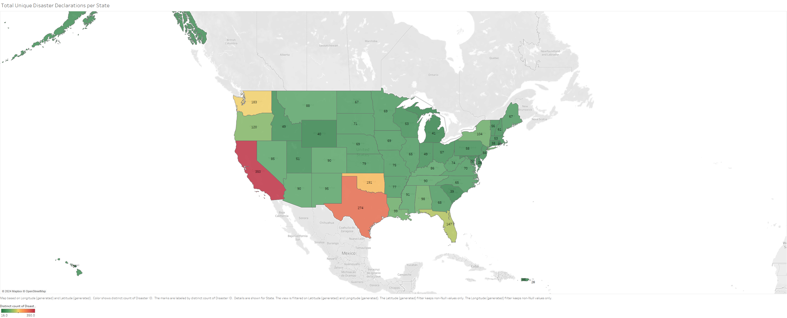
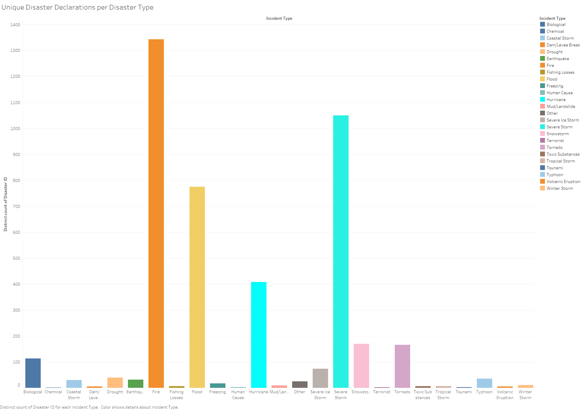
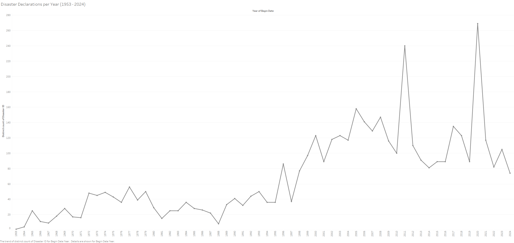
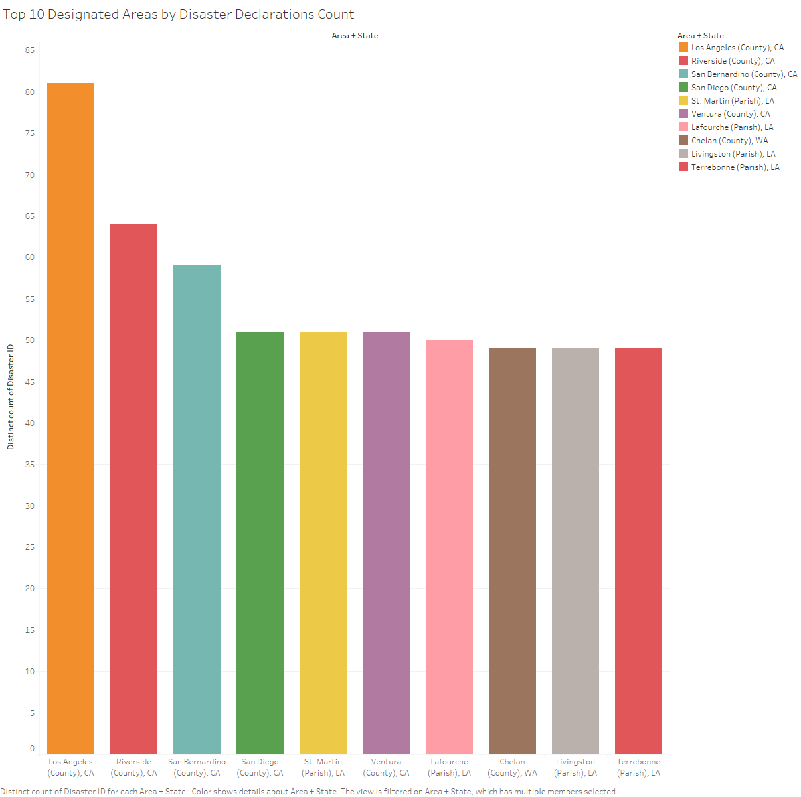
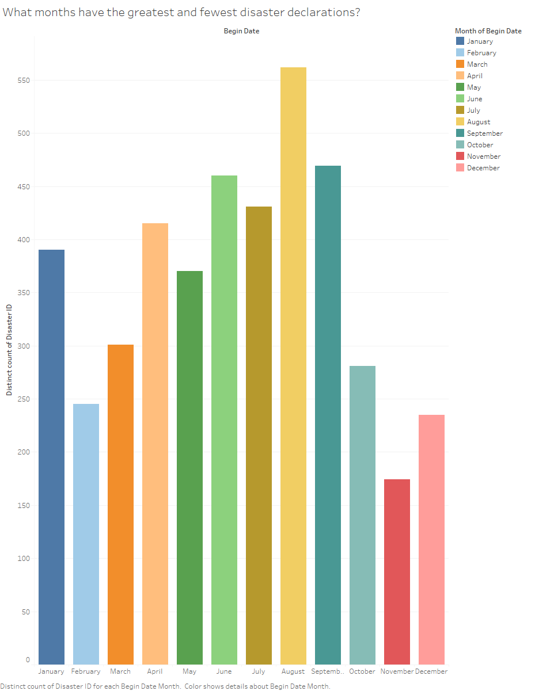

# FEMA Disaster Declarations Analysis

## Introduction:
This project utilizes the openFEMA dataset provided by fema.gov to analyse disaster trends in the United States. The dataset was pulled using the Disaster Declarations Summaries API. I have included a custom made CSV file pulled from wikipedia that details State population trends from 1960 to 2020, and a County Codes text file that contains every county in the US and their corresponding State and County codes. These files are called, cleaned, merged, and converted to SQL in the `main.py` python script. I then imported the created SQL database into Tableau to visualize the data.

## Setup:
### Virtual Environment (VENV) Setup:
Venv (for Python 3) allows you to manage separate package installations for different projects. It creates a “virtual” isolated Python installation. When you switch projects, you can create a new virtual environment which is isolated from other virtual environments. You benefit from the virtual environment since packages can be installed confidently and will not interfere with another project’s environment.

To create a virtual environment, go to your project’s directory and run the following command. This will create a new virtual environment in a local folder named `.venv`: 
&emsp;Windows: `python -m venv venv`. 
&emsp;MacOS/Unix: `python3 -m venv venv`. 
The second argument is the location to create the virtual environment. Generally, you can just create this in your project and call it .venv.

### Virtual Environment Activation:
Activating a virtual environment will put the virtual environment-specific `python` and `pip` executables into your shell’s `PATH`. 
&emsp;Windows: `venv\Scripts\activate`. 
&emsp;MacOS/Unix: `source venv/bin/activate`.

### Deactivate a virtual environment:
If you want to switch projects or leave your virtual environment, deactivate the environment: `deactivate`.

### Install packages using pip:
When your virtual environment is activated, you can install packages. Use the `pip install` command to install packages.

### Installing dependecies in requirments.txt: 
&emsp;Windows: `python -m pip install -r requirements.txt` 
&emsp;MacOS/Unix: `python3 -m pip install -r requirements.txt`

## How to Run:
### Step 1:
Running the script is simple once all of the dependencies have been installed. Simply run the python file `main.py` and the script will call the `DisasterDeclarationsSummaries` API from fema.gov. The script also pulls data from `county_codes.txt` and `StateCensusData.csv`. It then combines all three into a SQLite database using `pandas` dataframes and `SQLAlchemy`.

### Step 2:
The SQLite database is updated in the file `database.db`. This file can be opened in SQLite or any other SQL program that supports the .db file type.

## Features List:

### Loading Data:
> Read TWO data files (JSON, CSV, Excel, etc.).
My project reads an API call (JSON), a .csv, and a .txt file.
> Set up a local database and read data in with SQLite or SQLAlchemy.
My project uses SQLAlchemy to create a local database.

### Clean and operate on the data while combining them:
> If you’re using text data, get some information from your separate documents and summarize them in a DataFrame.
My project merges an API call and a .csv using Pandas DataFrames then prints a summary.

### Visualize / Present your data:
> Make a Tableau dashboard to display your data.
My project utilizes Tableau to create a dashboard with visualizations. The link is included below in the Visualizations section.

### Best practices: Enhance your project to a higher tier that will impress employers and help other programmers understand your project: 
> Utilize a virtual environment and include instructions in your README on how the user should set one up.
My project includes a venv (virtual enviornment) with the instructions on how to create and activate the venv above in the setup section.

### Interpretation of your data:
> Annotate your .py files with well-written comments and a clear README.md (only applicable if you’re not using a jupyter notebook).
My project has clear comments in my `main.py` as well as this `README.md`.

## Visualizations:

### Visualizations Link:
Visualizations Workbook: (https://us-east-1.online.tableau.com/#/site/aaronwmiller863e8871a59c/views/FemaDataWorkbook/Story1?:iid=3)

### Example Visualisations:  
This visualization shows the total number of unique disaster declarations per state: 
  
This visualization shows the total number of unique disaster declarations per incident type: 
  
This visualization shows the total number of unique disaster declarations per year over time:  
  
This visualization shows the top ten counties with the most unique disaster declarations historically: 
  
This visualization shows which months have the most and least unique disaster declarations historically: 
  

## Conclusion:
I went into this project hopeing to analyse the available FEMA dataset and compare disaster declarations, state/county populations, and the overall cost of each declaration.  Unfortunatly I was unable to source the overall disaster cost information. This forced me to narrow the scope of my project, however, I was still able to highlight some interesting trends and results focusing on the unique disaster counts per state and county. The unique counts were important, because some disasters had multiple entries due to the size and area affected by the disaster. FEMA assigns a unique disaster code to each disaster but include a row or entry for each different county/designated area affected. Among many other facts, my analysis highlighted that the states of California and Texas have historically suffered the most unique disasters, that fires are the most common disaster incident type, that Michigan has the least disaster declarations per current population, and that November is the month with the fewest disasters historically. I plan to continue this analysis and hope to include more county specific data, as well as potentially adding cost data if the data is actually available. I would also like to pull my data into PowerBI to see what visualization options are avaialable and how it is different from Tableau. Thank you for your time and interest.

